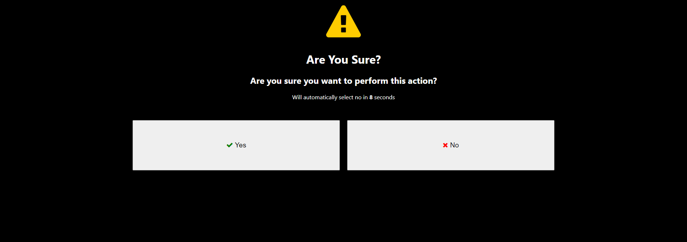
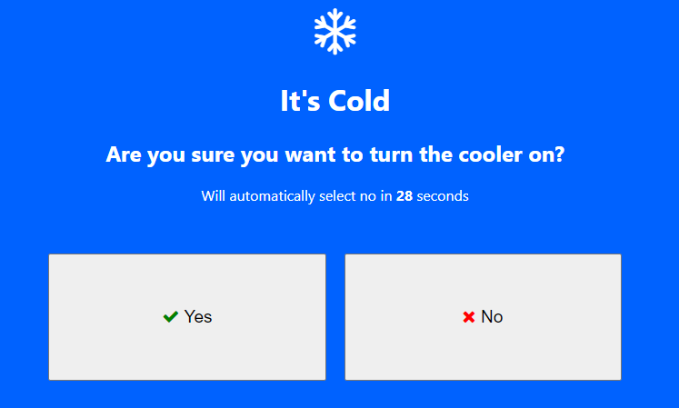

# Are You Sure? UI Widget for the NodeRed Dashboard
This is a simple NodeRED dashboard node that displays a full screen prompt asking the user if they wish to proceed with the action. It works by passing a message to the input which opens the dialog, if the user clicks yes it will pass to the yes output or like wise no for a no response.

## Default interface


## Custom interface


# Sending to input
To open the dialog send any message. If the response is "yes" it will output to the "yes" output, if no it will output to the "no" output. Additionally one can add the following to override the node properties:
```
{
    "options": {
        "icon": "",
        "title": "",
        "description": "",
        "timeoutSec": 10,

        //Change the colors (HTML colors)
        "iconColor": "",
        "textColor": "",
        "backgroundColor" ""
    }
    "payload": {}
}
```

# Output from the node
Will be the message sent on the input.
The top output is if the user clicked "yes" and the bottom is if the user clicked "no"

# Example
```
[{"id":"9b7def65.511f2","type":"ui_button","z":"61bcc5de.21c35c","name":"","group":"fb4ca7c3.864058","order":2,"width":0,"height":0,"passthru":false,"label":"Default","tooltip":"","color":"","bgcolor":"","className":"","icon":"","payload":"","payloadType":"str","topic":"topic","topicType":"msg","x":460,"y":400,"wires":[["ac88f140.a9ac6"]]},{"id":"b865717c.38f05","type":"debug","z":"61bcc5de.21c35c","name":"","active":true,"tosidebar":true,"console":false,"tostatus":false,"complete":"false","statusVal":"","statusType":"auto","x":810,"y":380,"wires":[]},{"id":"ac88f140.a9ac6","type":"ui_are_you_sure","z":"61bcc5de.21c35c","name":"","group":"fb4ca7c3.864058","iconColor":"#ffcc00","textColor":"#ffffff","backgroundColor":"#000000","icon":"fa fa-exclamation-triangle","title":"Are You Sure?","description":"Are you sure you want to perform this action?","timeoutSec":10,"x":620,"y":400,"wires":[["b865717c.38f05"],["cc8867e9.399f68"]]},{"id":"e3d65363.2e3d","type":"comment","z":"61bcc5de.21c35c","name":"Default Example","info":"","x":480,"y":340,"wires":[]},{"id":"cc8867e9.399f68","type":"debug","z":"61bcc5de.21c35c","name":"","active":true,"tosidebar":true,"console":false,"tostatus":false,"complete":"false","statusVal":"","statusType":"auto","x":810,"y":420,"wires":[]},{"id":"1eb12002.efad3","type":"ui_button","z":"61bcc5de.21c35c","name":"","group":"fb4ca7c3.864058","order":2,"width":0,"height":0,"passthru":false,"label":"Cold","tooltip":"","color":"","bgcolor":"","className":"","icon":"","payload":"","payloadType":"str","topic":"topic","topicType":"msg","x":450,"y":580,"wires":[["5de89ad.0636064"]]},{"id":"cd69ca3e.d45fc8","type":"debug","z":"61bcc5de.21c35c","name":"","active":true,"tosidebar":true,"console":false,"tostatus":false,"complete":"false","statusVal":"","statusType":"auto","x":810,"y":560,"wires":[]},{"id":"5de89ad.0636064","type":"ui_are_you_sure","z":"61bcc5de.21c35c","name":"","group":"fb4ca7c3.864058","iconColor":"#ffffff","textColor":"#ffffff","backgroundColor":"#0062ff","icon":"fa fa-snowflake-o","title":"It's Cold","description":"Are you sure you want to turn the cooler on?","timeoutSec":"30","x":620,"y":580,"wires":[["cd69ca3e.d45fc8"],["cf72466a.e3beb8"]]},{"id":"fff52a6e.842618","type":"comment","z":"61bcc5de.21c35c","name":"Default Example","info":"","x":480,"y":520,"wires":[]},{"id":"cf72466a.e3beb8","type":"debug","z":"61bcc5de.21c35c","name":"","active":true,"tosidebar":true,"console":false,"tostatus":false,"complete":"false","statusVal":"","statusType":"auto","x":810,"y":600,"wires":[]},{"id":"f4bdf09f.1d82","type":"inject","z":"61bcc5de.21c35c","name":"","props":[{"p":"payload"},{"p":"topic","vt":"str"}],"repeat":"","crontab":"","once":false,"onceDelay":0.1,"topic":"","payload":"","payloadType":"date","x":460,"y":440,"wires":[["ac88f140.a9ac6"]]},{"id":"e2c230c4.9026f","type":"inject","z":"61bcc5de.21c35c","name":"","props":[{"p":"payload"},{"p":"topic","vt":"str"}],"repeat":"","crontab":"","once":false,"onceDelay":0.1,"topic":"","payload":"","payloadType":"date","x":440,"y":620,"wires":[["5de89ad.0636064"]]},{"id":"fb4ca7c3.864058","type":"ui_group","name":"Default","tab":"64be35cd.7831bc","order":1,"disp":true,"width":"6","collapse":false,"className":""},{"id":"64be35cd.7831bc","type":"ui_tab","name":"Home","icon":"dashboard","disabled":false,"hidden":false}]
```